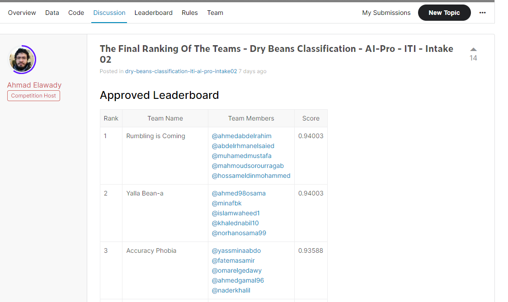

# Dry-Beans-Classification-Competition

This is For [InClass Prediction Competition]([https://www.kaggle.com/competitions/dry-beans-classification-iti-ai-pro-intake02/overview]

---

## description 
- the goal was to predict predict the type of each bean out of 7 bean types in this dataset.
- You are provided a set of features extracted from the shape of the beans in images
- ---

## File descriptions
- train.csv - the training set.
- test.csv - the test set.
- sample_submission.csv - a sample submission file in the correct format

---

## Data fields
* ID - an ID for this instance
* Area - (A), The area of a bean zone and the number of pixels within its boundaries.
* Perimeter - (P), Bean circumference is defined as the length of its border.
* MajorAxisLength - (L), The distance between the ends of the longest line that can be drawn from a bean.
* MinorAxisLength - (l), The longest line that can be drawn from the bean while standing perpendicular to the main axis.
* AspectRatio - (K), Defines the relationship between L and l.
* Eccentricity - (Ec), Eccentricity of the ellipse having the same moments as the region.
* ConvexArea - (C), Number of pixels in the smallest convex polygon that can contain the area of a bean seed.
* EquivDiameter - (Ed), The diameter of a circle having the same area as a bean seed area.
* Extent - (Ex), The ratio of the pixels in the bounding box to the bean area.
* Solidity - (S), Also known as convexity. The ratio of the pixels in the convex shell to those found in beans.
* Roundness - (R), Calculated with the following formula: (4piA)/(P^2)
* Compactness - (CO), Measures the roundness of an object: Ed/L
* ShapeFactor1 - (SF1)
* ShapeFactor2 - (SF2)
* ShapeFactor3 - (SF3)
* ShapeFactor4 - (SF4)
* y - the class of the bean. It can be any of BARBUNYA, SIRA, HOROZ, DERMASON, CALI, BOMBAY, and SEKER.

---

## Technologies and algorithms used

### algorithms

* Support vector classification
* Multilayer perceptron
* XGB classifier
* Voting classifier

### Training The Model

Trained using Kaggle CPU

---

## final Score 

* votingclassifier f1_score Train:  0.9502
* votingclassifier f1_score test:  0.94003

## Thanks to my team 
* HossamEldin Mohammed,
* Ahmed Abdel-Rahim El-Sayed,
* Abdelrhman Elsaied,
* mahmoud sorour ragab,
* Muhamed Mustafa 
* (Rumbling is Coming)

---
## Final result

